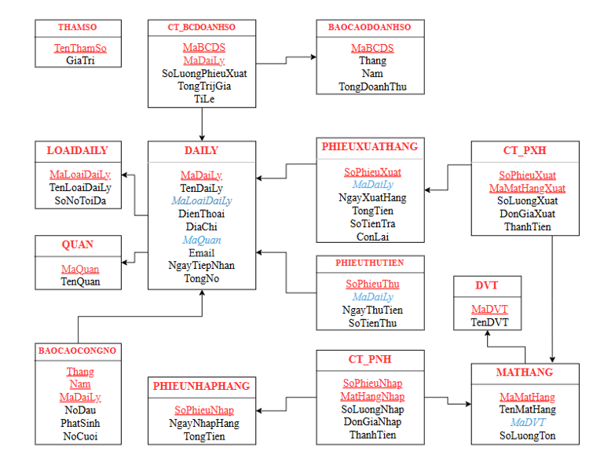

# QuanLyDaiLy

## Giới thiệu
Dự án **QuanLyDaiLy** là một hệ thống quản lý đại lý giúp theo dõi các hoạt động bán hàng, nhập hàng, thu tiền và báo cáo doanh số của các đại lý.

## Mục lục
- [Giới thiệu](#giới-thiệu)
- [Mục lục](#mục-lục)
- [Tính năng](#tính-năng)
- [Cấu trúc cơ sở dữ liệu](#cấu-trúc-cơ-sở-dữ-liệu)
- [Cài đặt](#cài-đặt)
- [Sử dụng](#sử-dụng)
- [Góp ý và phát triển](#góp-ý-và-phát-triển)
- [Liên hệ](#liên-hệ)

## Tính năng
- Quản lý thông tin đại lý, loại đại lý, quận.
- Quản lý phiếu xuất hàng, phiếu nhập hàng.
- Quản lý phiếu thu tiền.
- Báo cáo công nợ.
- Báo cáo doanh số.

## Cấu trúc cơ sở dữ liệu
Dưới đây là mô hình quan hệ cơ sở dữ liệu của dự án:



## Cài đặt
### Yêu cầu hệ thống
- .NET Framework 4.8 hoặc cao hơn
- SQL Server

### Hướng dẫn cài đặt
1. Clone repository:
    ```bash
    git clone https://github.com/username/QuanLyDaiLy.git
    ```
2. Mở file solution `QuanLyDaiLy.sln` trong Visual Studio.
3. Tạo cơ sở dữ liệu và chạy script `datascript.sql` để tạo các bảng và dữ liệu mẫu.
4. Cập nhật chuỗi kết nối cơ sở dữ liệu trong file cấu hình `app.config`.

## Sử dụng
1. Chạy ứng dụng bằng cách nhấn `F5` trong Visual Studio.
2. Đăng nhập vào hệ thống (nếu có yêu cầu).
3. Sử dụng các chức năng trong menu để quản lý đại lý, phiếu xuất, phiếu nhập, thu tiền và báo cáo.

## Góp ý và phát triển
Để đóng góp vào dự án, vui lòng thực hiện các bước sau:
1. Fork repository.
2. Tạo một nhánh mới cho tính năng hoặc sửa lỗi của bạn:
    ```bash
    git checkout -b feature/your-feature
    ```
3. Commit các thay đổi:
    ```bash
    git commit -m 'Add some feature'
    ```
4. Push lên nhánh vừa tạo:
    ```bash
    git push origin feature/your-feature
    ```
5. Tạo một Pull Request.

## Liên hệ
Nếu có bất kỳ câu hỏi hoặc yêu cầu hỗ trợ, vui lòng liên hệ qua email: 

